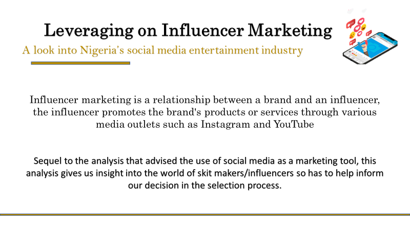
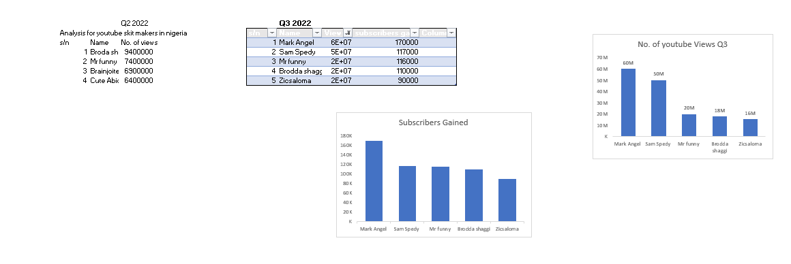
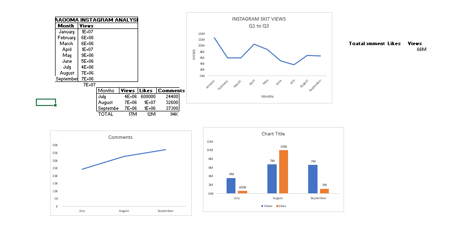

# Social-Media-Influencer-Analysis

## Introduction 
Influencer marketing is a relationship between a brand and an influencer, the influencer promotes the brand's products or services through various media outlets such as Instagram and YouTube 

## Skills Applied
- Analysis: _Microsoft Excel_
-  Visualization: _Microsoft Excel & PowerPoint_
-  Reporting: _PowerPoint_

**Disclaimer:** This project was a **_replication project_** originally carried out DataLeum

## Problem Statement 
1.Classify all influencers and rank them by follower count
2. Identify the influencer with the most emgagements on Instagram and Youtube
3. Gather insights from the analytics of these influencers on the period under review.

## Data cleaning and transformation 
:-----------------: | :--------------------
   |  
