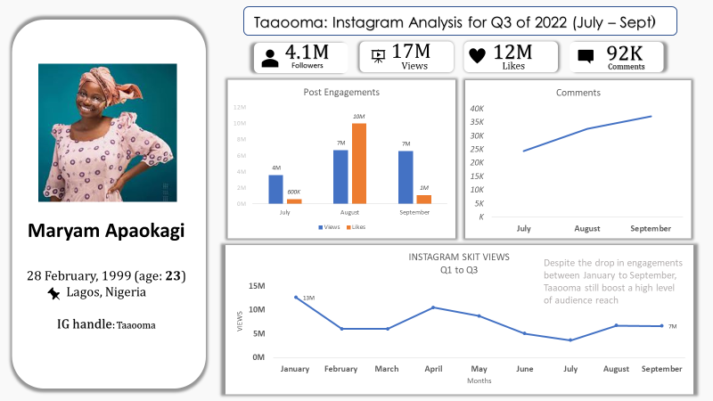

# Social-Media-Influencer-Analysis

## Introduction 
Influencer marketing is a relationship between a brand and an influencer, the influencer promotes the brand's products or services through various media outlets such as Instagram and YouTube 

## Skills Applied
- Analysis: _Microsoft Excel_
-  Visualization: _Microsoft Excel & PowerPoint_
-  Reporting: _PowerPoint_

**Disclaimer:** This project was a **_replication project_** originally carried out by DataLeum

## Problem Statement 
1. Classify all influencers and rank them by follower count
2. Identify the influencer with the most engagements on Instagram and Youtube
3. Gather insights from the analytics of these influencers on the period under review.

## Data cleaning and transformation 

 

## Analysis and Visualization 
---
 **In the dynamic realm of digital entertainment, 2021 saw the emergence of a new wave of creative talent - the top skit makers. Through a comprehensive analysis, I have identified and curated a list of individuals who redefined humor and storytelling through short, snappy videos.**
 

### Engagement Metrics on Instagram by Gender
----
- Among the notable influencers, Sabinus stands out as a male content creator, while Taooma shines as a female counterpart. These two dynamic personalities have carved their unique niches in the ever-evolving landscape of social media, each amassing a significant following and making a lasting impression on their respective audiences. Through their engaging content and relatable storytelling, Sabinus and Taooma have become influential figures, embodying the diverse and vibrant tapestry of Instagram's content creators.

  Male                         |               Female 
  :---------------------------:|:-------------------------
               | 

### Engagement metrics on Youtube 
---
- Mark Angel, the creative genius behind some of the most hilarious and relatable comedy sketches on YouTube, tops this category. With a knack for capturing everyday situations and adding a comedic twist, Mark Angel's channel has become a go-to destination for laughter and entertainment. Joined by a talented cast, including the lovable Emmanuella, Mark Angel's videos have garnered millions of views and a dedicated fan base worldwide.
  

## Conclusion and Recommendation 
Corporate brands are beginning to pay more attention to social advertising and the important role brand influencers play in this. Social media users with a huge following are gradually becoming television stations and newspaper pages for adverts and commercials.

- By all metrics, it is advised that the services of Mark Angel Comedy should be employed for brand promotion on YouTube, while Mr. Funny also known as Sabinus (male) and Taaooma(female) gets the nudge for promotion on Instagram. 

- ALTERNATIVELY, at an average view of 19m, the services of some notable names can also be considered. Such names include:
(1) Cute Abiola at 19m views 
(2) Lasisi at 17m views

#  Thank you for your time.

